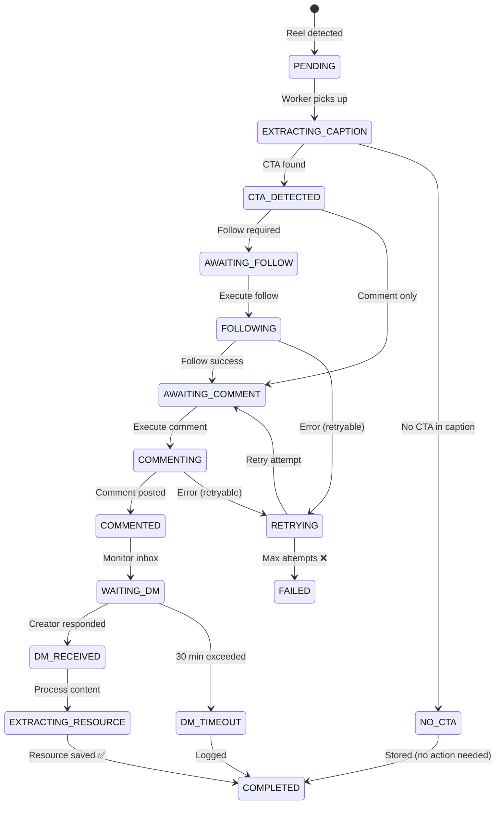
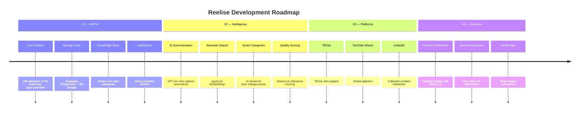

<div align="center">

<!-- Animated Header Banner -->


<br/>

<!-- Typing SVG -->
<a href="https://github.com/santosh5603/instantIQ">
  
</a>

<br/><br/>

<!-- Badges Row 1 — Status -->


<!-- Badges Row 2 — Tech -->


<!-- Badges Row 3 — Infra -->


<br/>

<!-- Divider -->


</div>

<br/>

## 📋 Table of Contents

<details open>
<summary><b>Click to expand</b></summary>

- [🧠 What is Reelise?](#-what-is-reelise)
- [🔥 The Problem](#-the-problem)
- [✨ The Solution](#-the-solution)
- [🎯 Key Features](#-key-features)
- [🏗️ Architecture](#️-architecture)
- [📁 Project Structure](#-project-structure)
- [⚙️ Tech Stack](#️-tech-stack)
- [🚀 Getting Started](#-getting-started)
  - [Prerequisites](#prerequisites)
  - [Installation](#installation)
  - [Environment Setup](#environment-setup)
  - [Running with Docker](#running-with-docker)
  - [Manual Setup](#manual-setup)
- [🔧 Configuration](#-configuration)
- [📡 API Reference](#-api-reference)
- [🔄 Pipeline Flow](#-pipeline-flow)
- [🧪 Testing](#-testing)
- [🗺️ Roadmap](#️-roadmap)
- [🤝 Contributing](#-contributing)
- [📄 License](#-license)
- [⚠️ Disclaimer](#️-disclaimer)

</details>

<br/>

<!-- What is Reelise -->


## 🧠 What is Reelise?

> **"Every reel you forward becomes a resource you own."**

**Reelise** is a personal knowledge automation system that transforms the passive act of saving an Instagram reel into an active, fully automated pipeline. It detects the creator's call-to-action (CTA), comments the required keyword, captures the DM response, and stores the resource in your **Notion knowledge base** — all with **zero manual follow-up**.

Think of it as a **personal bridge** between Instagram's creator economy and your second brain.

<div align="center">

```
📱 You save a reel  →  🤖 Reelise does everything else  →  📚 Resource lands in Notion
```

</div>

<br/>


## 🔥 The Problem

Instagram creators **gate valuable resources** behind engagement mechanics:

<div align="center">

| Creator CTA Pattern | What Happens |
|:---|:---|
| *"Comment **GUIDE** below 👇"* | Automation DMs you a PDF or link |
| *"Follow + Comment **PDF**"* | Requires follow before triggering resource |
| *"DM me **START**"* | Direct message triggers a drip sequence |
| *"Drop **AI** in the comments 🔥"* | Resource sent via DM after keyword comment |

</div>

### 😩 Why Users Fail to Claim Resources

```
❌  Scroll past at high speed → forget within seconds
❌  Friction of switching from watching to commenting breaks flow
❌  Save the reel to "do it later" → never happens
❌  Comment the keyword → never check DMs for the response
❌  Resources buried in DMs → impossible to find later
❌  No organization, search, or retrieval system
```

### 📉 The Knowledge Loss

Career guides, programming tutorials, AI toolkits, fitness protocols — **all lost** despite the user explicitly showing interest by saving the reel.

<br/>


## ✨ The Solution

Reelise automates the **entire pipeline** from reel share to structured knowledge entry — with just **one manual action**: sharing the reel to a collector account.

```mermaid
graph LR
    A["📱 Share Reel"] -->|"DM to collector"| B["🔍 Detect CTA"]
    B -->|"keyword found"| C["💬 Auto Comment"]
    B -->|"follow required"| C2["👤 Auto Follow"] --> C
    C --> D["📩 Monitor DMs"]
    D --> E["📦 Extract Resource"]
    E --> F["💾 Store in Supabase"]
    F --> G["📚 Sync to Notion"]

    style A fill:#6C63FF,stroke:#333,color:#fff
    style B fill:#FF6584,stroke:#333,color:#fff
    style C fill:#00C853,stroke:#333,color:#fff
    style C2 fill:#FFB74D,stroke:#333,color:#fff
    style D fill:#29B6F6,stroke:#333,color:#fff
    style E fill:#AB47BC,stroke:#333,color:#fff
    style F fill:#3FCF8E,stroke:#333,color:#fff
    style G fill:#000000,stroke:#333,color:#fff
```

<div align="center">



</div>

<br/>


## 🎯 Key Features

<div align="center">

| Feature | Description | Status |
|:---|:---|:---:|
| **🔎 DM Detection** | Monitors collector inbox for forwarded reels via instagrapi | ✅ |
| **📝 Caption Extraction** | Opens reel URL, extracts caption text via Playwright | ✅ |
| **🎯 CTA Detection Engine** | Keyword-based pattern matching with confidence scoring | ✅ |
| **👤 Auto Follow** | Follows creators when required, with daily limits & cooldowns | ✅ |
| **💬 Auto Comment** | Posts detected keyword with human-like typing & delays | ✅ |
| **📩 DM Monitoring** | Watches inbox for creator response up to 30 minutes | ✅ |
| **📦 Resource Extraction** | Downloads PDFs, links, media, and text from DMs | ✅ |
| **💾 Supabase Storage** | PostgreSQL + file storage as single source of truth | ✅ |
| **📚 Notion Sync** | Auto-creates categorized pages in Notion knowledge base | ✅ |
| **📊 Dashboard** | Next.js pipeline monitor with analytics & search | ✅ |
| **🔄 Retry & Recovery** | Exponential backoff, checkpointed stages, dead-letter queue | ✅ |
| **🩺 Health Monitoring** | API, Redis, DB, and worker health endpoints | ✅ |
| **🔍 Full-Text Search** | PostgreSQL GIN index search across captions & resources | ✅ |
| **📋 Process Logging** | Every pipeline step audited with error context | ✅ |

</div>

### 🤖 Human-Like Automation

Reelise is engineered to behave like a real user:

- 🕐 **Randomized delays** between actions (5–30 seconds)
- ⌨️ **Character-by-character typing** with 50–150ms per keystroke
- 🔄 **Consistent user agent** (not random rotation)
- 📐 **Realistic viewport sizes**
- 🛡️ **Daily action limits** (configurable follow/comment caps)
- 🍪 **Persistent session cookies** — no repeated logins

<br/>


## 🏗️ Architecture

<div align="center">

```
┌──────────────────────────────────────────────────────────────────────┐
│                         REELISE ARCHITECTURE                         │
└──────────────────────────────────────────────────────────────────────┘

  [Admin User]
       │
       │  (1) Shares reel via Instagram app
       ▼
  [Instagram App]
       │
       │  Share to DM → @collector_account
       ▼
  ┌─────────────────────────────────────────────────────┐
  │              GOOGLE CLOUD VM (Ubuntu)               │
  │                                                     │
  │  ┌─────────────────┐    ┌──────────────────────┐   │
  │  │  DM Listener    │    │  Automation Worker   │   │
  │  │  (instagrapi)   │───▶│  (Playwright)        │   │
  │  └─────────────────┘    └──────────┬───────────┘   │
  │                                    │               │
  │  ┌─────────────────────────────────▼────────────┐  │
  │  │              Redis Queue (RQ)               │  │
  │  │  reel_queue / comment_queue / notion_queue   │  │
  │  └─────────────────────────────────┬────────────┘  │
  └────────────────────────────────────│───────────────┘
                                       │
                                       │ HTTP
                                       ▼
  ┌─────────────────────────────────────────────────────┐
  │              RAILWAY (FastAPI Backend)              │
  │                                                     │
  │  ┌──────────┐ ┌──────────┐ ┌──────────┐           │
  │  │ Reels    │ │Resources │ │Analytics │           │
  │  │ Router   │ │ Router   │ │ Router   │           │
  │  └──────────┘ └──────────┘ └──────────┘           │
  └───────────────────────┬─────────────────────────────┘
                          │
          ┌───────────────┼───────────────┐
          ▼               ▼               ▼
  ┌──────────────┐ ┌─────────────┐ ┌──────────────┐
  │  Supabase    │ │  Supabase   │ │  Notion API  │
  │  PostgreSQL  │ │  Storage    │ │  Dashboard   │
  └──────────────┘ └─────────────┘ └──────────────┘
                          ▲
  ┌───────────────────────┘
  ▼
  ┌─────────────────────────────────────────────────────┐
  │              VERCEL (Next.js 14 Frontend)           │
  │                                                     │
  │  Dashboard / History / Resources / Logs / Search   │
  └─────────────────────────────────────────────────────┘
```

</div>

<br/>


## 📁 Project Structure

```
reelise/
│
├── 🐍 backend/                    # FastAPI REST API
│   ├── app/
│   │   ├── main.py               # Application entry point
│   │   ├── config.py             # Pydantic settings
│   │   ├── database.py           # SQLAlchemy async engine
│   │   ├── models/               # SQLAlchemy ORM models
│   │   │   ├── reel.py           #   ↳ Reel records
│   │   │   ├── dm_resource.py    #   ↳ Extracted resources
│   │   │   ├── creator_relationship.py  #   ↳ Follow tracking
│   │   │   └── process_log.py    #   ↳ Pipeline audit trail
│   │   ├── routers/              # API route handlers
│   │   │   ├── reels.py          #   ↳ CRUD + pipeline control
│   │   │   ├── resources.py      #   ↳ DM resource management
│   │   │   ├── creators.py       #   ↳ Creator relationships
│   │   │   ├── analytics.py      #   ↳ Dashboard analytics
│   │   │   ├── search.py         #   ↳ Full-text search
│   │   │   ├── logs.py           #   ↳ Process log viewer
│   │   │   └── health.py         #   ↳ Health checks
│   │   ├── schemas/              # Pydantic request/response
│   │   ├── services/             # Business logic
│   │   │   ├── notion_service.py #   ↳ Notion API integration
│   │   │   └── supabase_service.py  #   ↳ Storage operations
│   │   └── queue/                # Redis queue client
│   ├── Dockerfile
│   ├── requirements.txt
│   └── .env.example
│
├── 🤖 automation/                 # Instagram automation workers
│   ├── instagram/                # Core automation modules
│   │   ├── session.py            #   ↳ Playwright session mgmt
│   │   ├── cta_detector.py       #   ↳ CTA pattern matching
│   │   ├── comment_agent.py      #   ↳ Comment automation
│   │   ├── follow_agent.py       #   ↳ Follow automation
│   │   ├── dm_harvester.py       #   ↳ DM resource extraction
│   │   ├── dm_reader.py          #   ↳ DM content parsing
│   │   └── utils.py              #   ↳ Human-like delay utils
│   ├── workers/                  # Background job workers
│   │   ├── dm_listener_worker.py #   ↳ Inbox polling (instagrapi)
│   │   ├── reel_worker.py        #   ↳ Full pipeline processor
│   │   ├── notion_sync_worker.py #   ↳ Supabase → Notion sync
│   │   └── base_worker.py        #   ↳ Shared worker utilities
│   ├── Dockerfile
│   ├── requirements.txt
│   └── .env.example
│
├── 🎨 frontend/                   # Next.js 14 dashboard
│   ├── src/app/
│   │   ├── page.tsx              # Main dashboard page
│   │   ├── layout.tsx            # Root layout
│   │   └── globals.css           # Global styles
│   ├── package.json
│   └── tailwind.config.ts
│
├── 📜 scripts/                    # Setup & utility scripts
│   └── create_session.py        # Instagram session creator
│
├── 🐳 docker-compose.yml         # Full-stack orchestration
├── 📋 PRD.md                      # Product Requirements Document
├── 🛠️ TECH_STACK.md              # Technology decisions & rationale
├── 📐 APP_FLOW.md                 # Detailed pipeline flow docs
├── 🏗️ BACKEND_STRUCTURE.md       # Backend architecture docs
├── 🎨 FRONTEND_GUIDELINES.md     # Frontend conventions
└── 📄 .gitignore
```

<br/>


## ⚙️ Tech Stack

<div align="center">

| Layer | Technology | Purpose |
|:---|:---|:---|
| **Frontend** |    | Pipeline dashboard & analytics |
| **Backend API** |   | REST API, business logic, queue management |
| **Automation** |   | Browser automation & Instagram API |
| **Database** |   | Primary data store + file storage |
| **ORM** |  | Async database operations |
| **Queue** |   | Job queue with RQ workers |
| **Knowledge Base** |  | Resource browsing & organization |
| **Containers** |  | Local dev & production orchestration |
| **Deployment** |    | Frontend, API, and worker hosting |

</div>

<br/>


## 🚀 Getting Started

### Prerequisites

| Requirement | Version | Check |
|:---|:---|:---|
| Python | 3.12+ | `python --version` |
| Node.js | 20+ | `node --version` |
| Docker & Docker Compose | 26+ | `docker --version` |
| Git | Latest | `git --version` |

**External Services Required:**
- 🟢 [Supabase](https://supabase.com) account (free tier)
- 🔴 [Redis](https://redis.io) (self-hosted via Docker or [Upstash](https://upstash.com))
- ⬛ [Notion](https://www.notion.so) integration token
- 📸 Dedicated Instagram collector account

---

### Installation

```bash
# 1. Clone the repository
git clone https://github.com/santosh5603/instantIQ.git
cd instantIQ

# 2. Copy environment files
cp backend/.env.example backend/.env
cp automation/.env.example automation/.env
```

---

### Environment Setup

#### Backend (`backend/.env`)

```env
# Application
APP_ENV=development
APP_SECRET_KEY=<random-64-char-string>
API_PORT=8000

# Database (Supabase PostgreSQL)
DATABASE_URL=postgresql+asyncpg://postgres:<password>@db.<project>.supabase.co:5432/postgres
DATABASE_POOL_SIZE=5

# Redis
REDIS_URL=redis://localhost:6379/0

# Supabase
SUPABASE_URL=https://<project>.supabase.co
SUPABASE_ANON_KEY=<your-anon-key>
SUPABASE_SERVICE_KEY=<your-service-key>
SUPABASE_STORAGE_BUCKET=reelise-resources

# Instagram Collector Account
INSTAGRAM_USERNAME=<collector_username>
INSTAGRAM_PASSWORD=<collector_password>
INSTAGRAM_SESSION_PATH=session/instagram_session.json

# Notion
NOTION_API_KEY=secret_<your-token>
NOTION_RESOURCES_DB_ID=<database-id>

# Worker Constraints
MAX_DAILY_FOLLOWS=10
FOLLOW_COOLDOWN_SECONDS=300
COMMENT_DELAY_MIN=10
COMMENT_DELAY_MAX=30
DM_POLL_INTERVAL_MIN=45
DM_POLL_INTERVAL_MAX=90
DM_MAX_WAIT_MINUTES=30
```

#### Automation (`automation/.env`)

```env
REDIS_URL=redis://localhost:6379/0
SUPABASE_URL=https://<project>.supabase.co
SUPABASE_ANON_KEY=<your-anon-key>
SUPABASE_SERVICE_KEY=<your-service-key>
INSTAGRAM_USERNAME=<collector_username>
INSTAGRAM_PASSWORD=<collector_password>
INSTAGRAM_SESSION_PATH=session/instagram_session.json
```

---

### Running with Docker

> **Recommended** — This is the simplest way to get all services running.

```bash
# Build and start all services
docker compose up --build -d

# Verify services are running
docker compose ps

# View logs
docker compose logs -f

# Stop services
docker compose down
```

<details>
<summary><b>🐳 Services started by Docker Compose</b></summary>

| Service | Container | Port | Description |
|:---|:---|:---|:---|
| `api` | `reelise-api` | `8000` | FastAPI backend |
| `dm-listener` | `reelise-dm-listener` | — | DM inbox poller |
| `worker-rq` | `reelise-rq-worker` | — | Reel pipeline processor |
| `worker-notion-sync` | `reelise-notion-sync` | — | Notion sync worker |
| `rq-dashboard` | `reelise-rq-dashboard` | `9181` | Queue monitoring UI |
| `redis` | `reelise-redis` | `6379` | Message queue |

</details>

---

### Manual Setup

<details>
<summary><b>Click to expand manual setup instructions</b></summary>

#### Backend

```bash
cd backend

# Create virtual environment
python -m venv .venv
source .venv/bin/activate   # Linux/Mac
.venv\Scripts\activate      # Windows

# Install dependencies
pip install -r requirements.txt

# Run the FastAPI server
uvicorn app.main:app --host 0.0.0.0 --port 8000 --reload
```

#### Automation Workers

```bash
cd automation

# Create virtual environment
python -m venv .venv
source .venv/bin/activate

# Install dependencies
pip install -r requirements.txt

# Install Playwright browsers
playwright install chromium

# Create Instagram session (one-time)
python manual_login.py

# Start workers (in separate terminals)
python -m workers.dm_listener_worker
python -m workers.reel_worker
python -m workers.notion_sync_worker
```

#### Frontend

```bash
cd frontend

# Install dependencies
npm install

# Start development server
npm run dev
```

#### Redis

```bash
# Using Docker
docker run -d --name reelise-redis -p 6379:6379 redis:7-alpine
```

</details>

---

### Instagram Session Setup

The collector account needs a one-time manual login:

```bash
# Navigate to automation directory
cd automation

# Run the session creator
python manual_login.py
```

1. A browser window opens → **manually log in** to your collector account
2. Complete 2FA if prompted
3. Session is saved to `session/instagram_session.json`
4. All future worker runs reuse this session automatically

> ⚠️ **Important:** Keep the session file secure. It contains your collector account's authentication cookies.

<br/>


## 🔧 Configuration

### Worker Behavior Tuning

| Variable | Default | Description |
|:---|:---:|:---|
| `MAX_DAILY_FOLLOWS` | `10` | Max follow actions per day |
| `FOLLOW_COOLDOWN_SECONDS` | `300` | Min seconds between follows |
| `COMMENT_DELAY_MIN` | `10` | Min seconds before commenting |
| `COMMENT_DELAY_MAX` | `30` | Max seconds before commenting |
| `DM_POLL_INTERVAL_MIN` | `45` | Min seconds between DM checks |
| `DM_POLL_INTERVAL_MAX` | `90` | Max seconds between DM checks |
| `DM_MAX_WAIT_MINUTES` | `30` | Max wait time for creator DM |

### Notion Database Schema

Create a Notion database with these properties:

| Property | Type | Values |
|:---|:---|:---|
| Name | Title | Auto-generated |
| Category | Select | `AI`, `Career`, `Programming`, `Fitness`, `Communication`, `Other` |
| Resource Type | Select | `Link`, `PDF`, `Text`, `Media` |
| URL | URL | Resource link |
| Creator | Text | Instagram username |
| Caption | Text | First 200 chars |
| Status | Select | `Unread`, `Reading`, `Done`, `Archived` |
| Received At | Date | Auto-set |
| Source Reel | URL | Original reel link |

<br/>


## 📡 API Reference

The backend exposes a RESTful API with auto-generated Swagger documentation.

```
📖 Interactive Docs:  http://localhost:8000/docs
📋 ReDoc:             http://localhost:8000/redoc
```

### Core Endpoints

| Method | Endpoint | Description |
|:---|:---|:---|
| `GET` | `/health` | System health (API, DB, Redis) |
| `GET` | `/health/worker` | Worker heartbeat status |
| `GET` | `/health/queue` | Redis queue depths |
| | | |
| `GET` | `/api/reels` | List all processed reels |
| `GET` | `/api/reels/{id}` | Get reel details + timeline |
| `POST` | `/api/reels/reprocess/{id}` | Retry a failed reel |
| | | |
| `GET` | `/api/resources` | List extracted resources |
| `GET` | `/api/resources/{id}` | Get resource details |
| | | |
| `GET` | `/api/creators` | List creator relationships |
| `GET` | `/api/creators/{name}` | Get creator profile |
| | | |
| `GET` | `/api/search?q=<query>` | Full-text search |
| | | |
| `GET` | `/api/analytics` | Dashboard metrics |
| `GET` | `/api/logs` | Process audit trail |

<br/>


## 🔄 Pipeline Flow

Every reel goes through a deterministic, checkpointed pipeline:



### Pipeline Stages

| Stage | Code | Description |
|:---|:---:|:---|
| `PENDING` | `P` | Reel detected and queued |
| `EXTRACTING_CAPTION` | `EC` | Playwright opening reel URL |
| `CTA_DETECTED` | `CD` | Call-to-action found in caption |
| `NO_CTA` | `NC` | No CTA, reel stored as-is |
| `AWAITING_FOLLOW` | `AF` | Follow action queued |
| `COMMENTING` | `CM` | Comment being posted |
| `WAITING_DM` | `WD` | Monitoring for creator response |
| `COMPLETED` | `✅` | Resource stored & Notion synced |
| `FAILED` | `❌` | Unrecoverable error after retries |

<br/>


## 🧪 Testing

```bash
# Backend API health check
curl http://localhost:8000/health

# Queue status
curl http://localhost:8000/health/queue

# RQ Dashboard (queue monitoring)
open http://localhost:9181
```

<br/>


## 🗺️ Roadmap

<div align="center">



</div>

<br/>


## 🤝 Contributing

Contributions are welcome! Please read the contribution guidelines before getting started.

### How to Contribute

```bash
# 1. Fork the repository
# 2. Create a feature branch
git checkout -b feature/amazing-feature

# 3. Make your changes and commit
git commit -m "feat: add amazing feature"

# 4. Push to your fork
git push origin feature/amazing-feature

# 5. Open a Pull Request
```

### Commit Convention

This project follows [Conventional Commits](https://www.conventionalcommits.org/):

| Prefix | Use Case |
|:---|:---|
| `feat:` | New feature |
| `fix:` | Bug fix |
| `docs:` | Documentation only |
| `refactor:` | Code change (no feature/fix) |
| `test:` | Adding tests |
| `chore:` | Build process or tooling |

<br/>


## 📄 License

This project is licensed under the **MIT License** — see the [LICENSE](LICENSE) file for details.

<br/>


## ⚠️ Disclaimer

> **This project is a personal automation tool built for educational purposes.**

- Automated interactions with Instagram **violate Instagram's Terms of Service**
- This tool is designed for **single-user, personal use only** — not spam or commercial automation
- The developer assumes **no responsibility** for account restrictions or bans resulting from use
- Use at your **own risk** with full awareness of platform ToS implications
- **No data from other users** is collected, stored, or processed

<br/>

---

<div align="center">

<!-- Animated Footer -->


<br/>

**Built with ❤️ by [Santosh](https://github.com/santosh5603)**

<br/>


<br/>

*If this project saved you time, consider giving it a ⭐*

</div>
